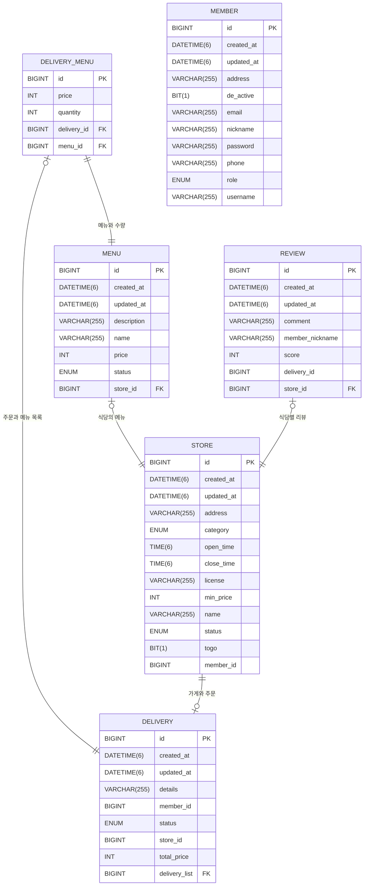

# 배달 서비스 프로젝트


### 👊 Spring Data JPA 팀 단위 개발 숙달을 위한 배달 서비스 백엔드 애플리케이션 서버 프로젝트 👊

#### 프로젝트 진행 기간: 24.11.01 ~ 24.11.07

## 프로젝트 목표

#### Spring AOP 관점에서 Spring 의 다양한 기술들을 활용하여 배달 서비스 구현 <br>

## 👨‍👨‍👧‍👧 팀 구성

| 이름    | 역할 | 담당 기능                                        |
|-------|----|----------------------------------------------|
| 김동주   | 팀원 | 회원가입, 로그인, 회원정보수정, 회원탈퇴, Spring Security JWT |
| 이은영   | 팀원 | 사업자 주문 관리(조회, 상태 변경), 메뉴 관리(등록, 수정, 삭제)      |
| 백현욱   | 팀원 | 사업자 가게 관리(등록, 수정, 삭제, 조회)                    |
| 장재혁   | 팀원 | 고객 Home 화면(가게 검색), 주문하기, 주문 조회               |
| 박가온누리 | 팀장 | 고객 리뷰 작성, 조회, 삭제, GlobalException            |

## Tools

### 🖥 language & Server 🖥

 <br>
  <br>
 <hr>

### 👏 Cowork Tools 👏

  <br> 
 
<br>
<hr/>

## 와이어 프레임


## 회원 관리 API 명세
<table>
    <tr>
        <th>API&nbsp;&nbsp;&nbsp;&nbsp;&nbsp;&nbsp;&nbsp;&nbsp;&nbsp;&nbsp;&nbsp;&nbsp;</th>
        <th>Method</th>
        <th>EndPoint</th>
        <th>Request</th>
        <th>Request Type</th>
        <th>Response</th>
        <th>Response Type</th>
        <th>Status</th>
        <th>Role</th>
    </tr>
    <tr>
        <td>회원가입</td>
        <td>POST</td>
        <td><code>/api/members/signup</code></td>
        <td><pre lang="json">{
    "email":"musubi123@email.com",
    "username":"무스비",
    "nickname":"무스비",
    "password":"Rkdhssnfl123!",
    "passwordCheck":"Rkdhssnfl123!",
    "role":"USER",
    "phone":"010-1234-5678",
    "address":"서울특별시"
}</pre></td>
        <td><code>application/json</code></td>
        <td><pre lang="json">{
    "email": "musubi123@email.com",
    "username": "무스비",
    "nickname": "무스비",
    "role": "USER",
    "phone": "010-1234-5678",
    "address": "서울특별시"
}</pre></td>
        <td><code>application/json</code></td>
        <td>201</td>
        <td>USER, OWNER</td>
    </tr>
     <tr>
        <td>로그인</td>
        <td>POST</td>
        <td><code>/api/members/login</code></td>
        <td><pre lang="json">{
    "email":"musubi123@email.com",
    "password":"Rkdhssnfl123!"
}</pre></td>
        <td><code>application/json</code></td>
        <td><pre lang="json">{
    "email": "musubi123@email.com",
    "username": "무스비",
    "nickname": "무스비"
}</pre></td>
        <td><code>application/json</code></td>
        <td>200</td>
        <td>USER, OWNER</td>
    </tr>
    <tr>
        <td>회원 정보 조회</td>
        <td>GET</td>
        <td><code>/api/members/profile</code></td>
        <td><code>N/A</code></td>
        <td><code>N/A</code></td>
        <td><pre lang="json">{
    "email": "musubi123@email.com",
    "username": "무스비",
    "nickname": "무스비",
    "role": "USER",
    "phone": "010-1234-5678",
    "address": "서울특별시"
}</pre></td>
        <td><code>application/json</code></td>
        <td>200</td>
        <td>USER, OWNER</td>
    </tr>
    <tr>
        <td>회원 정보 수정</td>
        <td>PUT</td>
        <td><code>/api/members/profile</code></td>
        <td><pre lang="json">{
  "username": "updateduser",
  "nickname": "updatednick",
  "email": "test2@example.com",
  "phone": "010-8765-4321",
  "address": "Busan"
}</pre></td>
        <td><code>application/json</code></td>
        <td><pre lang="json">{
    "email": "test2@example.com",
    "username": "updateduser",
    "nickname": "updatednick",
    "role": "USER",
    "phone": "010-8765-4321",
    "address": "Busan"
}</pre></td>
        <td><code>application/json</code></td>
        <td>200</td>
        <td>USER, OWNER</td>
    </tr>
    <tr>
        <td>비밀번호 변경</td>
        <td>PUT</td>
        <td><code>/api/members/password</code></td>
        <td><pre lang="json">{
  "email": "test2@example.com",
  "newPassword": "Ehdwn123!",
  "passwordCheck": "Ehdwn123!"
}</pre></td>
        <td><code>application/json</code></td>
        <td><code>N/A</code></td>
        <td><code>application/json</code></td>
        <td>204</td>
        <td>USER, OWNER</td>
    </tr>
    <tr>
        <td>회원 탈퇴</td>
        <td>PATCH</td>
        <td><code>/api/members</code></td>
        <td><pre lang="json">{
    "password": "Rkdhssnfl123!"
}</pre></td>
        <td><code>application/json</code></td>
        <td><code>N/A</code></td>
        <td><code>N/A</code></td>
        <td>204</td>
        <td>USER, OWNER</td>
</table>

## 사업자 API 명세
<table>
    <tr>
        <th>API&nbsp;&nbsp;&nbsp;&nbsp;&nbsp;&nbsp;&nbsp;&nbsp;&nbsp;&nbsp;&nbsp;&nbsp;</th>
        <th>Method</th>
        <th>EndPoint</th>
        <th>Request</th>
        <th>Request Type</th>
        <th>Response</th>
        <th>Response Type</th>
        <th>Status</th>
        <th>Role</th>
    </tr>
    <tr>
        <td>가게 등록</td>
        <td>POST</td>
        <td><code>/api/seller/stores</code></td>
        <td><pre lang="json">{
    "name" : "새벽의 아침",
    "openTime" : "10:00:00",
    "closeTime" : "23:00:00",
    "minPrice" : "50000",
    "category" : "CHINESE",
    "address" : "서울특별시 어쩌구 저쩌구",
    "license" : "111-00-12345",
    "togo" : "false"
}</pre></td>
        <td><code>application/json</code></td>
        <td><pre lang="json">{
    "name": "새벽의 아침",
    "openTime": "10:00:00",
    "closeTime": "23:00:00",
    "minPrice": 50000,
    "category": "CHINESE",
    "address": "서울특별시 어쩌구 저쩌구",
    "license": "111-00-12345",
    "togo": false,
    "status": "OPEN",
    "memberId": 3
}</pre></td>
        <td><code>application/json</code></td>
        <td>201</td>
        <td>OWNER</td>
    </tr>
     <tr>
        <td>가게 전체 조회</td>
        <td>GET</td>
        <td><code>/api/seller/stores</code></td>
        <td><code>N/A</code></td>
        <td><code>N/A</code></td>
        <td><pre lang="json">[
    {
        "name": "새벽의 아침",
        "openTime": "10:00:00",
        "closeTime": "23:00:00",
        "minPrice": 50000,
        "category": "CHINESE",
        "address": "서울특별시 어쩌구 저쩌구",
        "license": "111-00-12345",
        "togo": false,
        "status": "OPEN",
        "memberId": 3
    },
    {
        "name": "이븐한 가게",
        "openTime": "10:00:00",
        "closeTime": "22:00:00",
        "minPrice": 50000,
        "category": "KOREAN",
        "address": "서울특별시 어쩌구 저쩌동",
        "license": "111-00-12345",
        "togo": true,
        "status": "OPEN",
        "memberId": 3
    }
]</pre></td>
        <td><code>application/json</code></td>
        <td>200</td>
        <td>OWNER</td>
    </tr>
    <tr>
        <td>특정 가게 조회</td>
        <td>GET</td>
        <td><code>/api/seller/stores/{storeId}</code></td>
        <td><code>N/A</code></td>
        <td><code>PathVariable</code></td>
        <td><pre lang="json">{
    "name": "이븐한 가게",
    "openTime": "10:00:00",
    "closeTime": "22:00:00",
    "minPrice": 50000,
    "category": "KOREAN",
    "address": "서울특별시 어쩌구 저쩌동",
    "license": "111-00-12345",
    "togo": true,
    "status": "OPEN",
    "memberId": 3
}</pre></td>
        <td><code>application/json</code></td>
        <td>200</td>
        <td>OWNER</td>
    </tr>
    <tr>
        <td>가게 정보 수정</td>
        <td>PUT</td>
        <td><code>/api/seller/stores/{storeId}</code></td>
        <td><pre lang="json">{
"name":"굽네치킨종로점",
"openTime": "10:00:00",
"closeTime": "23:00:00",
"minPrice":12000,
"category":"KOREAN",
"togo":"false",
"status":"OPEN"
}</pre></td>
        <td><code>PathVariable, application/json</code></td>
        <td><pre lang="json">{
    "name": "굽네치킨종로점",
    "openTime": "10:00:00",
    "closeTime": "23:00:00",
    "minPrice": 12000,
    "category": "KOREAN",
    "address": "서울특별시 어쩌구 저쩌동",
    "license": "111-00-12345",
    "togo": false,
    "status": "OPEN",
    "memberId": 3
}</pre></td>
        <td><code>application/json</code></td>
        <td>200</td>
        <td>OWNER</td>
    </tr>
    <tr>
        <td>가게 폐업</td>
        <td>PATCH</td>
        <td><code>/api/seller/stores/{storeId}</code></td>
        <td><code>N/A</code></td>
        <td><code>PathVariable</code></td>
        <td><code>N/A</code></td>
        <td><pre lang="json">{
    "name": "새벽의 아침",
    "openTime": "10:00:00",
    "closeTime": "23:00:00",
    "minPrice": 50000,
    "category": "CHINESE",
    "address": "서울특별시 어쩌구 저쩌구",
    "license": "111-00-12345",
    "togo": false,
    "status": "CLOSE",
    "memberId": 3
}</pre></td>
        <td>200</td>
        <td>OWNER</td>
    </tr>
    <tr>
        <td>가게별 주문 조회</td>
        <td>GET</td>
        <td><code>/api/seller/stores/{storeId}/deliveries</code></td>
        <td><code>N/A</code></td>
        <td><code>PathVariable, RequestParam</code></td>
        <td><pre lang="json">{
    "content": [
        {
            "id": 1,
            "details": "문앞에 두고 노크해주세요",
            "status": "PENDING",
            "totalPrice": 39000,
            "storeId": 1
        }
    ],
    "pageable": {
        "pageNumber": 0,
        "pageSize": 10,
        "sort": {
            "empty": false,
            "sorted": true,
            "unsorted": false
        },
        "offset": 0,
        "paged": true,
        "unpaged": false
    },
    "last": true,
    "totalPages": 1,
    "totalElements": 1,
    "first": true,
    "size": 10,
    "number": 0,
    "sort": {
        "empty": false,
        "sorted": true,
        "unsorted": false
    },
    "numberOfElements": 1,
    "empty": false
}</pre></td>
        <td><code>application/json</code></td>
        <td>200</td>
        <td>OWNER</td>
    </tr>
    <tr>
        <td>주문 상태 변경</td>
        <td>PUT</td>
        <td><code>/api/seller/stores/{storeId}/deliveries/{deliveryId}</code></td>
        <td><code>N/A</code></td>
        <td><code>PathVariable, RequestParam</code></td>
        <td><pre lang="json">{
    "id": 1,
    "details": "문앞에 두고 노크해주세요",
    "status": "IN_PROGRESS",
    "totalPrice": 39000,
    "storeId": 1
}</pre></td>
        <td><code>application/json</code></td>
        <td>200</td>
        <td>OWNER</td>
    </tr>
    <tr>
        <td>메뉴 등록</td>
        <td>POST</td>
        <td><code>/api/seller/stores/{storeId}/menus</code></td>
        <td><pre lang="json">{
    "name" : "진짜! 레몬에이드",
    "price" : "6000",
    "description" : "100% 생레몬"
}</pre></td>
        <td><code>application/json</code></td>
        <td><pre lang="json">{
    "id": 5,
    "name": "진짜! 레몬에이드",
    "price": 6000,
    "description": "100% 생레몬",
    "status": "FOR_SALE",
    "createdAt": "2024-11-06T21:12:02.147502",
    "updatedAt": "2024-11-06T21:12:02.147502"
}</pre></td>
        <td><code>application/json</code></td>
        <td>201</td>
        <td>OWNER</td>
    </tr>
    <tr>
        <td>메뉴 수정</td>
        <td>PUT</td>
        <td><code>/api/seller/stores/{storeId}/menus/{menuId}</code></td>
        <td><pre lang="json">{
    "name" : "연어 포케",
    "price" : "12000",
    "description" : "맛있는 연어 포케~~"
}</pre></td>
        <td><code>PathVariable, application/json</code></td>
        <td><pre lang="json">{
    "id": 4,
    "name": "연어 포케",
    "price": 12000,
    "description": "맛있는 연어 포케~~",
    "status": "FOR_SALE",
    "createdAt": "2024-11-06T21:11:54.978596",
    "updatedAt": "2024-11-06T21:11:54.978596"
}</pre></td>
        <td><code>application/json</code></td>
        <td>200</td>
        <td>OWNER</td>
    </tr>
    <tr>
        <td>메뉴 삭제</td>
        <td>PATCH</td>
        <td><code>/api/seller/stores/{storeId}/menus/{menuId}</code></td>
        <td><code>N/A</code></td>
        <td><code>PathVariable</code></td>
        <td><pre lang="json">{
    "id": 4,
    "name": "연어 포케",
    "price": 12000,
    "description": "맛있는 연어 포케~~",
    "status": "NOT_FOR_SALE",
    "createdAt": "2024-11-06T21:11:54.978596",
    "updatedAt": "2024-11-06T21:13:05.812328"
}</pre></td>
        <td><code>application/json</code></td>
        <td>200</td>
        <td>OWNER</td>
    </tr>
</table>

## 이용자 API 명세
<table>
    <tr>
        <th>API&nbsp;&nbsp;&nbsp;&nbsp;&nbsp;&nbsp;&nbsp;&nbsp;&nbsp;&nbsp;&nbsp;&nbsp;</th>
        <th>Method</th>
        <th>EndPoint</th>
        <th>Request</th>
        <th>Request Type</th>
        <th>Response</th>
        <th>Response Type</th>
        <th>Status</th>
        <th>Role</th>
    </tr>
    <tr>
        <td>가게 전체 조회</td>
        <td>GET</td>
        <td><code>/api/stores</code></td>
        <td><code>N/A</code></td>
        <td><code>N/A</code></td>
        <td><pre lang="json">[
    {
        "id": 1,
        "name": "새벽의 아침4",
        "openTime": "10:00:00",
        "closeTime": "23:00:00",
        "category": "CHINESE",
        "address": "서울특별시 어쩌구 저쩌구",
        "togo": false,
        "status": "OPEN"
    },
    {
        "id": 3,
        "name": "굽네치킨종로점",
        "openTime": "10:00:00",
        "closeTime": "23:00:00",
        "category": "KOREAN",
        "address": "서울특별시 어쩌구 저쩌동",
        "togo": false,
        "status": "OPEN"
    }
]</pre></td>
        <td><code>application/json</code></td>
        <td>200</td>
        <td>USER</td>
    </tr>
    <tr>
        <td>카테고리별 가게 조회</td>
        <td>GET</td>
        <td><code>/api/stores</code></td>
        <td><code>N/A</code></td>
        <td><code>RequestParam</code></td>
        <td><pre lang="json">[
    {
        "id": 1,
        "name": "새벽의 아침4",
        "openTime": "10:00:00",
        "closeTime": "23:00:00",
        "category": "CHINESE",
        "address": "서울특별시 어쩌구 저쩌구",
        "togo": false,
        "status": "OPEN"
    }
]</pre></td>
        <td><code>application/json</code></td>
        <td>200</td>
        <td>USER</td>
    </tr>
    <tr>
        <td>검색별 가게 조회</td>
        <td>GET</td>
        <td><code>/api/stores</code></td>
        <td><code>N/A</code></td>
        <td><code>RequestParam</code></td>
        <td><pre lang="json">[
    {
        "id": 1,
        "name": "새벽의 아침4",
        "openTime": "10:00:00",
        "closeTime": "23:00:00",
        "category": "CHINESE",
        "address": "서울특별시 어쩌구 저쩌구",
        "togo": false,
        "status": "OPEN"
    }
]</pre></td>
        <td><code>application/json</code></td>
        <td>200</td>
        <td>USER</td>
    </tr>
    <tr>
        <td>특정 가게 조회</td>
        <td>GET</td>
        <td><code>/api/stores/{storeId}</code></td>
        <td><code>N/A</code></td>
        <td><code>PathVariable</code></td>
        <td><pre lang="json">{
    "id": 1,
    "name": "새벽의 아침4",
    "openTime": "10:00:00",
    "closeTime": "23:00:00",
    "category": "CHINESE",
    "address": "서울특별시 어쩌구 저쩌구",
    "togo": false,
    "status": "OPEN",
    "menus": [
        {
            "id": 1,
            "name": "카라멜 마끼아또",
            "price": 6500,
            "description": null
        },
        {
            "id": 2,
            "name": "진짜! 레몬에이드",
            "price": 6000,
            "description": null
        }
    ]
}</pre></td>
        <td><code>application/json</code></td>
        <td>200</td>
        <td>USER</td>
    </tr>
    <tr>
        <td>주문 하기</td>
        <td>GET</td>
        <td><code>/api/stores/{storeId}</code></td>
        <td><pre lang="json">[
	{
		"menuId":1,
		"quantity":3
	},
	{
		"menuId":3,
		"quantity":3
	}
]</pre></td>
        <td><code>PathVariable, RequestBody</code></td>
        <td><pre lang="json">{
    "id": 1,
    "details": "문앞에 두고 노크해주세요",
    "status": "PENDING",
    "totalPrice": 39000,
    "deliveryMenus": [
        {
            "id": 1,
            "name": "카라멜 마끼아또",
            "quantity": 3,
            "price": 19500
        },
        {
            "id": 3,
            "name": "카라멜 마끼아또",
            "quantity": 3,
            "price": 19500
        }
    ]
}</pre></td>
        <td><code>application/json</code></td>
        <td>200</td>
        <td>USER</td>
    </tr>
    <tr>
        <td>전체 주문 조회</td>
        <td>GET</td>
        <td><code>/api/deliveries</code></td>
        <td><code>N/A</code></td>
        <td><code>PathVariable, application/json</code></td>
        <td><pre lang="json">[
    {
        "id": 1,
        "details": "문앞에 두고 노크해주세요",
        "status": "PENDING",
        "totalPrice": 39000
    }
]</pre></td>
        <td><code>application/json</code></td>
        <td>200</td>
        <td>USER</td>
    </tr>
    <tr>
        <td>리뷰 작성</td>
        <td>POST</td>
        <td><code>/api/stores/{storeId}/deliveries/{deliveryId}/reviews</code></td>
        <td><pre lang="json">{
    "score": "3",
    "comment": "맛있게 먹었습니다."
}</pre></td>
        <td><code>application/json</code></td>
        <td><pre lang="json">{
    "score": "3",
    "comment": "맛있게 먹었습니다."
}</pre></td>
        <td><code>application/json</code></td>
        <td>200</td>
        <td>USER</td>
    </tr>
    <tr>
        <td>리뷰 조회</td>
        <td>GET</td>
        <td><code>/api/stores/{storeId}/reviews</code></td>
        <td><code>N/A</code></td>
        <td><code>PathVariable</code></td>
        <td><pre lang="json">{
    "reviews": [
        {
            "id": 4,
            "score": 4,
            "comment": "맛있게 잘 먹었습니다.",
            "createdAt": "2024-11-06T20:11:09.05758",
            "memberNickname": "눌눌",
            "deliveryId": 1
        }
    ],
    "totalPages": 1,
    "totalElements": 1
}</pre></td>
        <td><code>application/json</code></td>
        <td>200</td>
        <td>USER</td>
    </tr>
    <tr>
        <td>별점별 리뷰 조회</td>
        <td>GET</td>
        <td><code>/api/stores/{storeId}/reviews</code></td>
        <td><code>N/A</code></td>
        <td><code>RequestParam</code></td>
        <td><pre lang="json">{
    "reviews": [
        {
            "id": 4,
            "score": 4,
            "comment": "맛있게 잘 먹었습니다.",
            "createdAt": "2024-11-06T20:11:09.05758",
            "memberNickname": "눌눌",
            "deliveryId": 1
        }
    ],
    "totalPages": 1,
    "totalElements": 1
}</pre></td>
        <td><code>application/json</code></td>
        <td>200</td>
        <td>USER</td>
    </tr>
</table>


## ERD


## 프로젝트 구조

```plaintext
├─common
│  ├─config
│  ├─entity
│  ├─enums
│  ├─exception
│  ├─security
│  └─util
└─domain
    ├─customer  -> 장재혁, 박가온누리
    │  ├─controller
    │  ├─dto
    │  ├─repository
    │  └─service
    ├─member  -> 김동주
    │  ├─controller
    │  ├─dto
    │  ├─repository
    │  └─service
    └─seller  -> 이은영, 백현욱
       ├─controller
       ├─dto
       ├─repository
       └─service
```

## Application 핵심 기능 시연 영상
[Watch the video on YouTube](https://www.youtube.com/watch?v=Ppg730LI3jE)

## 코드 커버리지


