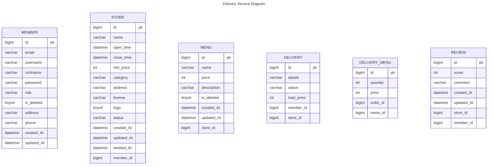

# 배달 서비스 프로젝트

### 👊 Spring Data JPA 팀 단위 개발 숙달을 위한 배달 서비스 백엔드 애플리케이션 서버 프로젝트 👊

#### 프로젝트 진행 기간: 24.11.01 ~ 24.11.07

## 프로젝트 목표

#### Spring AOP 관점에서 Spring 의 다양한 기술들을 활용하여 배달 서비스 구현  

## 👨‍👨‍👧‍👧 팀 구성

| 이름    | 역할 | 담당 기능                                        |
|-------|----|----------------------------------------------|
| 김동주   | 팀원 | 회원가입, 로그인, 회원정보수정, 회원탈퇴, Spring Security JWT |
| 이은영   | 팀원 | 사업자 주문 관리(조회, 상태 변경), 메뉴 관리(등록, 수정, 삭제)      |
| 백현욱   | 팀원 | 사업자 가게 관리(등록, 수정, 삭제, 조회)                    |
| 장재혁   | 팀원 | 고객 Home 화면(가게 검색), 주문하기, 주문 조회               |
| 박가온누리 | 팀장 | 고객 리뷰 작성, 조회, 삭제, GlobalException            |

## Tools

### 🖥 language & Server 🖥

  
   
 

### 👏 Cowork Tools 👏

    
 
 

## 와이어 프레임

## 회원 관리 API 명세
<table>
    <tr>
        <th>API&nbsp;&nbsp;&nbsp;&nbsp;&nbsp;&nbsp;&nbsp;&nbsp;&nbsp;&nbsp;&nbsp;&nbsp;</th>
        <th>Method</th>
        <th>EndPoint</th>
        <th>Request</th>
        <th>Request Type</th>
        <th>Response</th>
        <th>Response Type</th>
        <th>Status</th>
        <th>Role</th>
    </tr>
    <tr>
        <td>회원가입</td>
        <td>POST</td>
        <td><code>/api/members/signup</code></td>
        <td><pre lang="json">{
    email: String,
    username: String,
    nickname: String,
    password: String,
    passwordCheck: String,
    role: String,
    phone: String,
    address: String
}</pre></td>
        <td><code>application/json</code></td>
        <td><pre lang="json">{
    email: String,
    username: String,
    nickname: String,
    password: String,
    passwordCheck: String,
    role: String,
    phone: String,
    address: String
}</pre></td>
        <td><code>application/json</code></td>
        <td>201</td>
        <td>USER, OWNER</td>
    </tr>
     <tr>
        <td>로그인</td>
        <td>POST</td>
        <td><code>/api/members/login</code></td>
        <td><pre lang="json">{
    "email": String,
    "password": String
}</pre></td>
        <td><code>application/json</code></td>
        <td><pre lang="json">{
    "email": String,
    "password": String
}</pre></td>
        <td><code>application/json</code></td>
        <td>200</td>
        <td>USER, OWNER</td>
    </tr>
    <tr>
        <td>회원 정보 조회</td>
        <td>GET</td>
        <td><code>/api/members/profile</code></td>
        <td><code>N/A</code></td>
        <td><code>N/A</code></td>
        <td><pre lang="json">{
    email: String,
    username: String,
    nickname: String,
    role: String,
    phone: String,
    address: String
}</pre></td>
        <td><code>application/json</code></td>
        <td>200</td>
        <td>USER, OWNER</td>
    </tr>
    <tr>
        <td>회원 정보 수정</td>
        <td>PUT</td>
        <td><code>/api/members/profile</code></td>
        <td><pre lang="json">{
    email: String,
    username: String,
    nickname: String,
    password: String,
    passwordCheck: String,
    role: String,
    phone: String,
    address: String
}</pre></td>
        <td><code>application/json</code></td>
        <td><pre lang="json">{
    email: String,
    username: String,
    nickname: String,
    password: String,
    passwordCheck: String,
    role: String,
    phone: String,
    address: String
}</pre></td>
        <td><code>application/json</code></td>
        <td>200</td>
        <td>USER, OWNER</td>
    </tr>
    <tr>
        <td>비밀번호 변경</td>
        <td>PUT</td>
        <td><code>/api/members/password</code></td>
        <td><pre lang="json">{
    email: String,
    username: String,
    nickname: String,
    password: String,
    passwordCheck: String,
    role: String,
    phone: String,
    address: String
}</pre></td>
        <td><code>application/json</code></td>
        <td><pre lang="json">{
    email: String,
    username: String,
    nickname: String,
    password: String,
    passwordCheck: String,
    role: String,
    phone: String,
    address: String
}</pre></td>
        <td><code>application/json</code></td>
        <td>204</td>
        <td>USER, OWNER</td>
    </tr>
    <tr>
        <td>회원 탈퇴</td>
        <td>PATCH</td>
        <td><code>/api/members</code></td>
        <td><pre lang="json">{
    "password": String
}</pre></td>
        <td><code>application/json</code></td>
        <td><code>N/A</code></td>
        <td><code>N/A</code></td>
        <td>204</td>
        <td>USER, OWNER</td>
</table>

## 사업자 API 명세
<table>
    <tr>
        <th>API&nbsp;&nbsp;&nbsp;&nbsp;&nbsp;&nbsp;&nbsp;&nbsp;&nbsp;&nbsp;&nbsp;&nbsp;</th>
        <th>Method</th>
        <th>EndPoint</th>
        <th>Request</th>
        <th>Request Type</th>
        <th>Response</th>
        <th>Response Type</th>
        <th>Status</th>
        <th>Role</th>
    </tr>
    <tr>
        <td>가게 등록</td>
        <td>POST</td>
        <td><code>/api/seller/stores</code></td>
        <td><pre lang="json">{
    email: String,
    username: String,
    nickname: String,
    password: String,
    passwordCheck: String,
    role: String,
    phone: String,
    address: String
}</pre></td>
        <td><code>application/json</code></td>
        <td><pre lang="json">{
    email: String,
    username: String,
    nickname: String,
    password: String,
    passwordCheck: String,
    role: String,
    phone: String,
    address: String
}</pre></td>
        <td><code>application/json</code></td>
        <td>201</td>
        <td>OWNER</td>
    </tr>
     <tr>
        <td>가게 전체 조회</td>
        <td>GET</td>
        <td><code>/api/seller/stores</code></td>
        <td><code>N/A</code></td>
        <td><code>N/A</code></td>
        <td><pre lang="json">{
    "email": String,
    "password": String
}</pre></td>
        <td><code>application/json</code></td>
        <td>200</td>
        <td>OWNER</td>
    </tr>
    <tr>
        <td>특정 가게 조회</td>
        <td>GET</td>
        <td><code>/api/seller/stores/{storeId}</code></td>
        <td><code>N/A</code></td>
        <td><code>PathVariable</code></td>
        <td><pre lang="json">{
    email: String,
    username: String,
    nickname: String,
    role: String,
    phone: String,
    address: String
}</pre></td>
        <td><code>application/json</code></td>
        <td>200</td>
        <td>OWNER</td>
    </tr>
    <tr>
        <td>가게 정보 수정</td>
        <td>PUT</td>
        <td><code>/api/seller/stores/{storeId}</code></td>
        <td><pre lang="json">{
    email: String,
    username: String,
    nickname: String,
    password: String,
    passwordCheck: String,
    role: String,
    phone: String,
    address: String
}</pre></td>
        <td><code>PathVariable, application/json</code></td>
        <td><pre lang="json">{
    email: String,
    username: String,
    nickname: String,
    password: String,
    passwordCheck: String,
    role: String,
    phone: String,
    address: String
}</pre></td>
        <td><code>application/json</code></td>
        <td>200</td>
        <td>OWNER</td>
    </tr>
    <tr>
        <td>가게 폐업</td>
        <td>PATCH</td>
        <td><code>/api/seller/stores/{storeId}</code></td>
        <td><code>N/A</code></td>
        <td><code>PathVariable</code></td>
        <td><code>N/A</code></td>
        <td><code>N/A</code></td>
        <td>200</td>
        <td>OWNER</td>
    </tr>
    <tr>
        <td>가게별 주문 조회</td>
        <td>GET</td>
        <td><code>/api/seller/stores/{storeId}/deliveries</code></td>
        <td><code>N/A</code></td>
        <td><code>PathVariable, RequestParam</code></td>
        <td><pre lang="json">{
    email: String,
    username: String,
    nickname: String,
    password: String,
    passwordCheck: String,
    role: String,
    phone: String,
    address: String
}</pre></td>
        <td><code>application/json</code></td>
        <td>200</td>
        <td>OWNER</td>
    </tr>
    <tr>
        <td>주문 상태 변경</td>
        <td>PUT</td>
        <td><code>/api/seller/stores/{storeId}/deliveries/{deliveryId}</code></td>
        <td><code>N/A</code></td>
        <td><code>PathVariable, RequestParam</code></td>
        <td><pre lang="json">{
    email: String,
    username: String,
    nickname: String,
    password: String,
    passwordCheck: String,
    role: String,
    phone: String,
    address: String
}</pre></td>
        <td><code>application/json</code></td>
        <td>200</td>
        <td>OWNER</td>
    </tr>
    <tr>
        <td>메뉴 등록</td>
        <td>POST</td>
        <td><code>/api/seller/stores/{storeId}/menus</code></td>
        <td><pre lang="json">{
    email: String,
    username: String,
    nickname: String,
    password: String,
    passwordCheck: String,
    role: String,
    phone: String,
    address: String
}</pre></td>
        <td><code>application/json</code></td>
        <td><pre lang="json">{
    email: String,
    username: String,
    nickname: String,
    password: String,
    passwordCheck: String,
    role: String,
    phone: String,
    address: String
}</pre></td>
        <td><code>application/json</code></td>
        <td>201</td>
        <td>OWNER</td>
    </tr>
    <tr>
        <td>메뉴 수정</td>
        <td>PUT</td>
        <td><code>/api/seller/stores/{storeId}/menus/{menuId}</code></td>
        <td><pre lang="json">{
    email: String,
    username: String,
    nickname: String,
    password: String,
    passwordCheck: String,
    role: String,
    phone: String,
    address: String
}</pre></td>
        <td><code>PathVariable, application/json</code></td>
        <td><pre lang="json">{
    email: String,
    username: String,
    nickname: String,
    password: String,
    passwordCheck: String,
    role: String,
    phone: String,
    address: String
}</pre></td>
        <td><code>application/json</code></td>
        <td>200</td>
        <td>OWNER</td>
    </tr>
    <tr>
        <td>메뉴 삭제</td>
        <td>PATCH</td>
        <td><code>/api/seller/stores/{storeId}/menus/{menuId}</code></td>
        <td><code>N/A</code></td>
        <td><code>PathVariable</code></td>
        <td><code>N/A</code></td>
        <td><code>N/A</code></td>
        <td>200</td>
        <td>OWNER</td>
    </tr>
</table>

## 이용자 API 명세
<table>
    <tr>
        <th>API&nbsp;&nbsp;&nbsp;&nbsp;&nbsp;&nbsp;&nbsp;&nbsp;&nbsp;&nbsp;&nbsp;&nbsp;</th>
        <th>Method</th>
        <th>EndPoint</th>
        <th>Request</th>
        <th>Request Type</th>
        <th>Response</th>
        <th>Response Type</th>
        <th>Status</th>
        <th>Role</th>
    </tr>
    <tr>
        <td>가게 전체 조회</td>
        <td>GET</td>
        <td><code>/api/stores</code></td>
        <td><code>N/A</code></td>
        <td><code>N/A</code></td>
        <td><pre lang="json">{
    email: String,
    username: String,
    nickname: String,
    password: String,
    passwordCheck: String,
    role: String,
    phone: String,
    address: String
}</pre></td>
        <td><code>application/json</code></td>
        <td>200</td>
        <td>USER</td>
    </tr>
    <tr>
        <td>카테고리별 가게 조회</td>
        <td>GET</td>
        <td><code>/api/stores</code></td>
        <td><code>N/A</code></td>
        <td><code>RequestParam</code></td>
        <td><pre lang="json">{
    email: String,
    username: String,
    nickname: String,
    password: String,
    passwordCheck: String,
    role: String,
    phone: String,
    address: String
}</pre></td>
        <td><code>application/json</code></td>
        <td>200</td>
        <td>USER</td>
    </tr>
    <tr>
        <td>검색별 가게 조회</td>
        <td>GET</td>
        <td><code>/api/stores</code></td>
        <td><code>N/A</code></td>
        <td><code>RequestParam</code></td>
        <td><pre lang="json">{
    email: String,
    username: String,
    nickname: String,
    password: String,
    passwordCheck: String,
    role: String,
    phone: String,
    address: String
}</pre></td>
        <td><code>application/json</code></td>
        <td>200</td>
        <td>USER</td>
    </tr>
    <tr>
        <td>특정 가게 조회</td>
        <td>GET</td>
        <td><code>/api/stores/{storeId}</code></td>
        <td><code>N/A</code></td>
        <td><code>PathVariable</code></td>
        <td><pre lang="json">{
    email: String,
    username: String,
    nickname: String,
    role: String,
    phone: String,
    address: String
}</pre></td>
        <td><code>application/json</code></td>
        <td>200</td>
        <td>USER</td>
    </tr>
    <tr>
        <td>주문 하기</td>
        <td>GET</td>
        <td><code>/api/stores/{storeId}</code></td>
        <td><code>N/A</code></td>
        <td><code>PathVariable</code></td>
        <td><pre lang="json">{
    email: String,
    username: String,
    nickname: String,
    role: String,
    phone: String,
    address: String
}</pre></td>
        <td><code>application/json</code></td>
        <td>200</td>
        <td>USER</td>
    </tr>
    <tr>
        <td>가게 정보 수정</td>
        <td>PUT</td>
        <td><code>/api/seller/stores/{storeId}</code></td>
        <td><pre lang="json">{
    email: String,
    username: String,
    nickname: String,
    password: String,
    passwordCheck: String,
    role: String,
    phone: String,
    address: String
}</pre></td>
        <td><code>PathVariable, application/json</code></td>
        <td><pre lang="json">{
    email: String,
    username: String,
    nickname: String,
    password: String,
    passwordCheck: String,
    role: String,
    phone: String,
    address: String
}</pre></td>
        <td><code>application/json</code></td>
        <td>200</td>
        <td>OWNER</td>
    </tr>
    <tr>
        <td>가게 폐업</td>
        <td>PATCH</td>
        <td><code>/api/seller/stores/{storeId}</code></td>
        <td><code>N/A</code></td>
        <td><code>PathVariable</code></td>
        <td><code>N/A</code></td>
        <td><code>N/A</code></td>
        <td>200</td>
        <td>OWNER</td>
    </tr>
    <tr>
        <td>가게별 주문 조회</td>
        <td>GET</td>
        <td><code>/api/seller/stores/{storeId}/deliveries</code></td>
        <td><code>N/A</code></td>
        <td><code>PathVariable, RequestParam</code></td>
        <td><pre lang="json">{
    email: String,
    username: String,
    nickname: String,
    password: String,
    passwordCheck: String,
    role: String,
    phone: String,
    address: String
}</pre></td>
        <td><code>application/json</code></td>
        <td>200</td>
        <td>OWNER</td>
    </tr>
    <tr>
        <td>주문 상태 변경</td>
        <td>PUT</td>
        <td><code>/api/seller/stores/{storeId}/deliveries/{deliveryId}</code></td>
        <td><code>N/A</code></td>
        <td><code>PathVariable, RequestParam</code></td>
        <td><pre lang="json">{
    email: String,
    username: String,
    nickname: String,
    password: String,
    passwordCheck: String,
    role: String,
    phone: String,
    address: String
}</pre></td>
        <td><code>application/json</code></td>
        <td>200</td>
        <td>OWNER</td>
    </tr>
    <tr>
        <td>메뉴 등록</td>
        <td>POST</td>
        <td><code>/api/seller/stores/{storeId}/menus</code></td>
        <td><pre lang="json">{
    email: String,
    username: String,
    nickname: String,
    password: String,
    passwordCheck: String,
    role: String,
    phone: String,
    address: String
}</pre></td>
        <td><code>application/json</code></td>
        <td><pre lang="json">{
    email: String,
    username: String,
    nickname: String,
    password: String,
    passwordCheck: String,
    role: String,
    phone: String,
    address: String
}</pre></td>
        <td><code>application/json</code></td>
        <td>201</td>
        <td>OWNER</td>
    </tr>
    <tr>
        <td>메뉴 수정</td>
        <td>PUT</td>
        <td><code>/api/seller/stores/{storeId}/menus/{menuId}</code></td>
        <td><pre lang="json">{
    email: String,
    username: String,
    nickname: String,
    password: String,
    passwordCheck: String,
    role: String,
    phone: String,
    address: String
}</pre></td>
        <td><code>PathVariable, application/json</code></td>
        <td><pre lang="json">{
    email: String,
    username: String,
    nickname: String,
    password: String,
    passwordCheck: String,
    role: String,
    phone: String,
    address: String
}</pre></td>
        <td><code>application/json</code></td>
        <td>200</td>
        <td>OWNER</td>
    </tr>
    <tr>
        <td>메뉴 삭제</td>
        <td>PATCH</td>
        <td><code>/api/seller/stores/{storeId}/menus/{menuId}</code></td>
        <td><code>N/A</code></td>
        <td><code>PathVariable</code></td>
        <td><code>N/A</code></td>
        <td><code>N/A</code></td>
        <td>200</td>
        <td>OWNER</td>
    </tr>
</table>

## ERD

